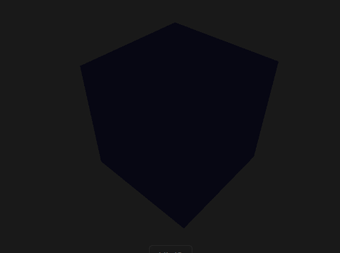
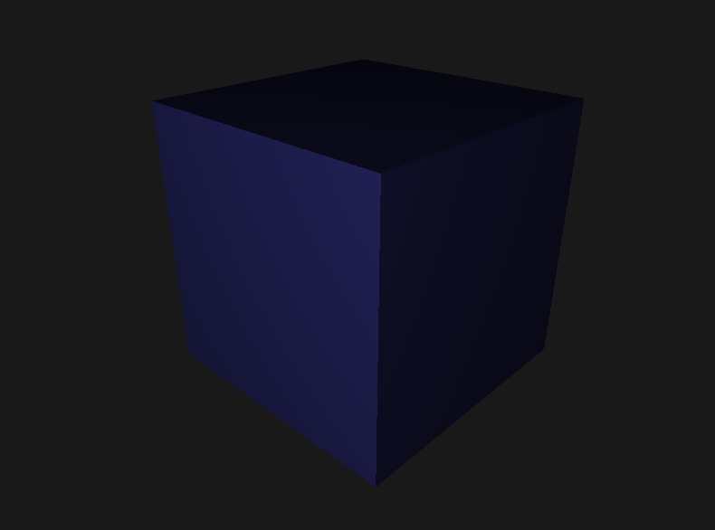
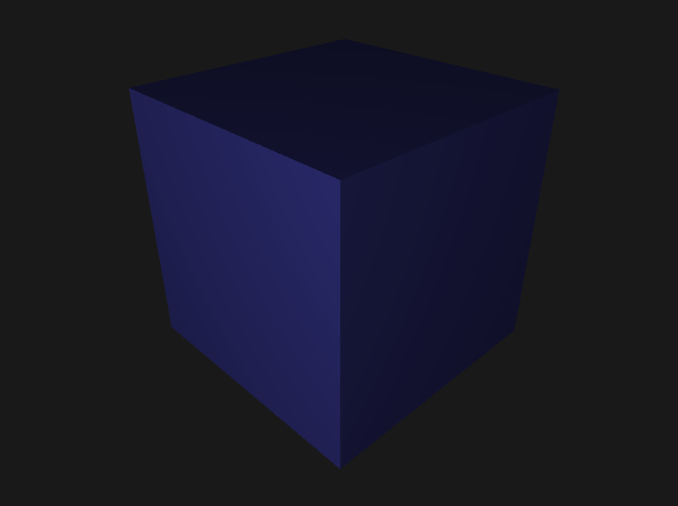
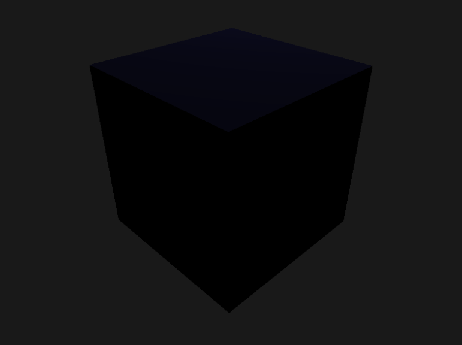
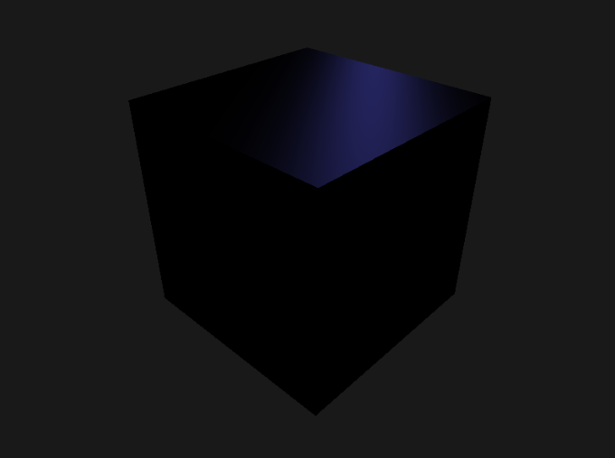
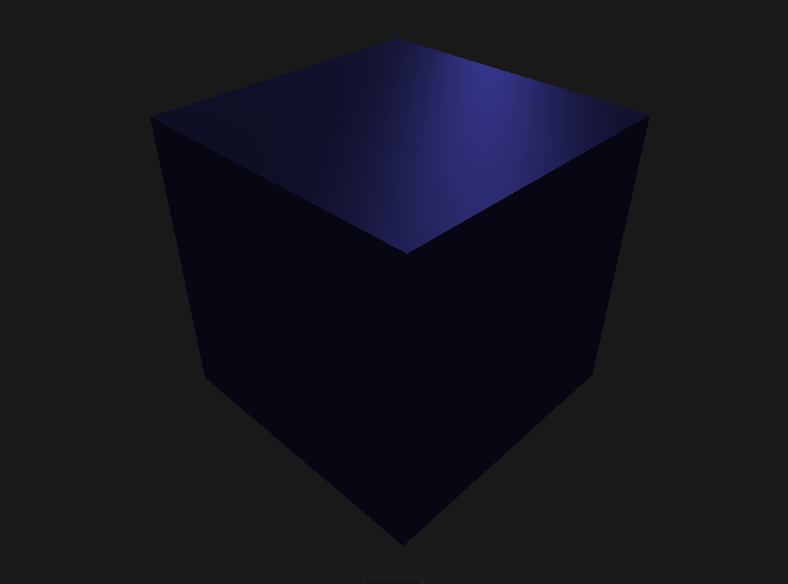

# About
This is homework assignment 3 for COSC4370 Interactive Graphics. In this assignment, we must implement multiple shading methods by using opengl. The methods used are ambient, diffuse, specular, and phong. Each require different equations to calculate the rgb value per pixel. Since there is only one light source, there are areas where the diffuse and spcular shading methods had no effect. The ambient shading method on the other hand makes it so the whole object has the same color everywhere since it does not rely on any directional vectors. The phong shading method combines each of these methods creating a detailed shadow that is dependent on the camera's view (since it uses the specular method). If the object color is black (0, 0, 0) or white (255, 255, 255) issues arise with these algorithms. This is why I chose a color of (128, 128, 128). For the light color I chose an approximately close value to the hw color of (73, 73, 190).

# Development Enviornment
Ubuntu<br/>
  * IDE: Visual Studio Code<br/>
  * apt-get packages<br/>
    * OpenGL<br/>
    ```sudo apt-get install libglu1-mesa-dev freeglut3-dev mesa-common-dev```<br/>
    * GLM<br/>
    ```sudo apt-get install libglm-dev```<br/>

    * GLFW (per https://github.com/glfw/glfw/issues/808 second comment instructions)<br/>
      ```sudo install libglfw3-dev```<br/>
    * GLEW<br/>
      ```sudo install libglew-dev```<br/>

# Example Outputs
| Camera Direction | Ambient | Diffuse | Specular | Phong |
| ---------------- | ------- | ------- | -------- | ----- |
| Front Top Right Corner |  |  |  |  |
| Back Top Left Corner |  |  |  |  |
All the images can be found in the ./images folder. name1.png for first row pictures and name2.png for second row pictures.

# References
Lecture 11 - shade - part 2.pdf<br/>
* Ambient equation: Page 10
* Diffuse equation: Page 4
* Specular equation: Page 7
* Phong equation: Page 11

# Program 
Use the following command by replacing X with 0, 1, 2, or 3
* 0 for ambient shader only
* 1 for diffuse shader only
* 2 for specular shader only
* 3 for phong shader
```sh
g++ -std=c++11 main.cpp -o main -lGL -lGLEW -lglfw;
./main X; # replace X here
```