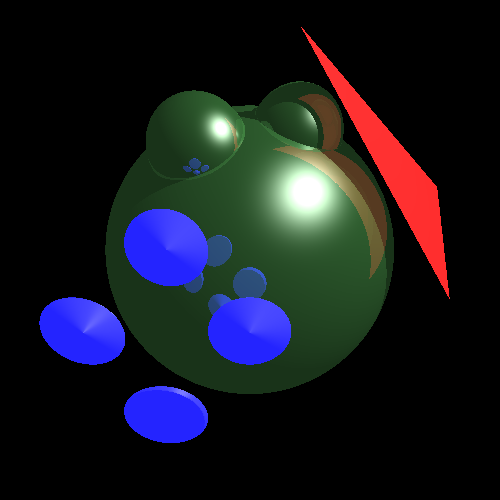

# About
This is homework assignment 3 for COSC4370 Interactive Graphics. In this assignment, we must implement multiple shading methods by using the library Eigen and raytracing. The methods used are ambient, diffuse, specular, and phong. Similar to homework 3, each requires different equations to calculate the rgb value per pixel. The difference here is we use a combination of implict shapes and ray tracing to produce reflections and shadows. This light source at the location (3,3,0) shines over all the objects in view causing shadowing to occur once objects are behind other objects. There are areas where the diffuse and specular shading methods have no effect due to it's dependence on the camera view direction. The ambient shading method relies on both the view direction and shading rays (point at which a target is hit in the direction of the light) to determine if it uses ambient shading only (due to a shadow) or combine with the others (phong). The additional shapes used are triangle and plate which are both implicit shapes in this implementation. Since each custom shape must be able to have their own material specifications as far as color is concered, 3 vector values were added for each shading method representing shadingCoefficient * lightColor. This determines how strong and what color the effect should have on the object for each shading type. When ray tracing, these values are used if there was a hit (intersection). When tracing the reflecting rays, there is a depth limit (5) to prevent large amounts of reflecting rays which would normally prolong the rasterizing time. As you can see in the picture, the reflection and shadows correctly depict what would normally happen in the real world. The large sphere in view provides a good backdrop for all these effects and shows shading, shadow, and reflection.

# Development Enviornment
Ubuntu<br/>
  * IDE: Visual Studio Code<br/>
  * apt-get packages<br/>
    * Png<br/>
    ```sudo apt-get install libpng-dev```<br/>
    * Eigen3<br/>
    ```sudo apt-get install libeigen3-dev```<br/>

# Output


# References
Shapes<br/>
* Disk: https://www.scratchapixel.com/lessons/3d-basic-rendering/minimal-ray-tracer-rendering-simple-shapes/ray-plane-and-ray-disk-intersection<br/>
* Triangle: https://www.scratchapixel.com/lessons/3d-basic-rendering/ray-tracing-rendering-a-triangle/ray-triangle-intersection-geometric-solution<br/>

Formulas<br/>
* Reflection: https://math.stackexchange.com/questions/13261/how-to-get-a-reflection-vector
  * r = d - 2 * d * n * n<br/>
* Shading: Lecture 11 - shade - part 2.pdf<br/>
  * Ambient equation: Page 10<br/>
  * Diffuse equation: Page 4<br/>
  * Specular equation: Page 7<br/>
  * Phong equation: Page 11<br/>

# Program 
Use the following command
```sh
g++ -std=c++11 main.cpp Image.cpp Scene.cpp Shape.cpp Sphere.cpp Disk.cpp Triangle.cpp -lpng -o main; ./main;
```
